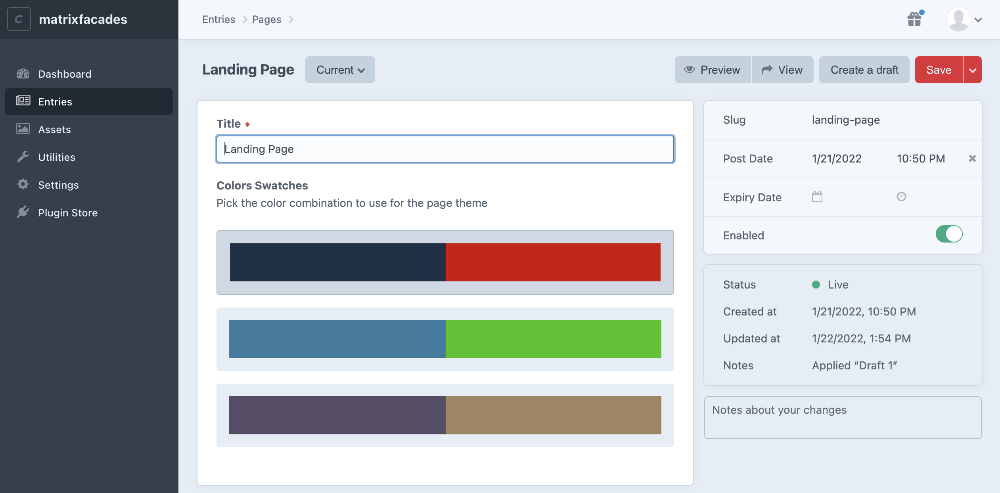
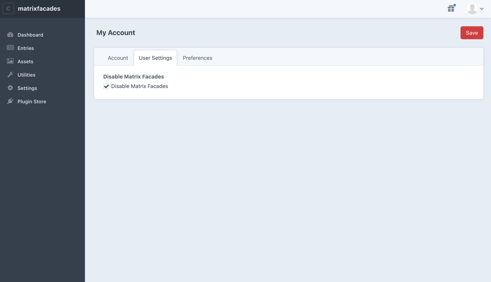
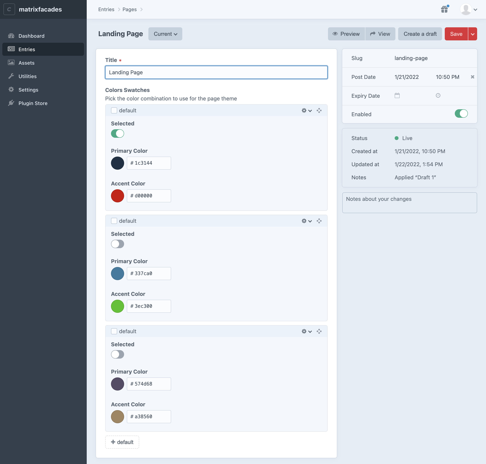
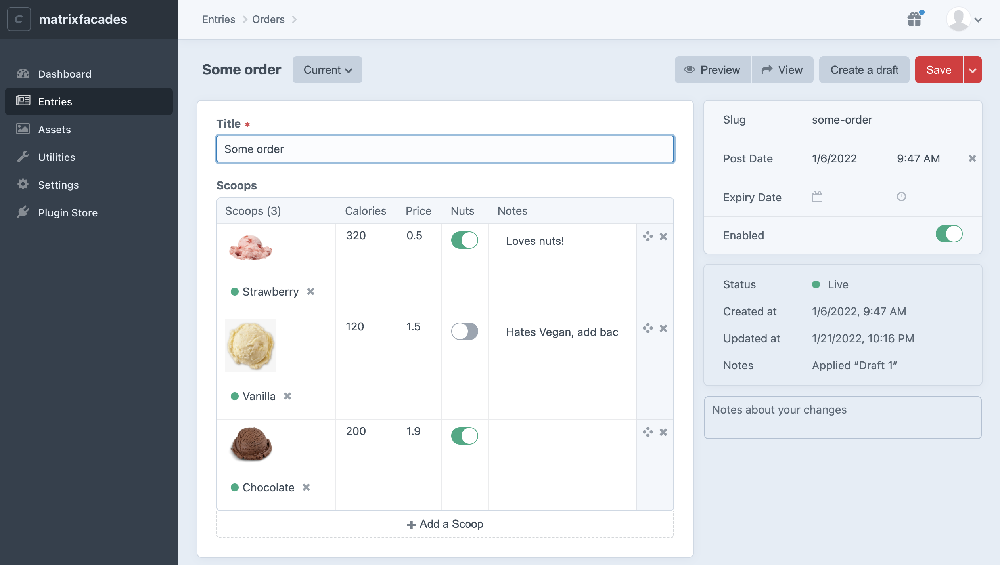
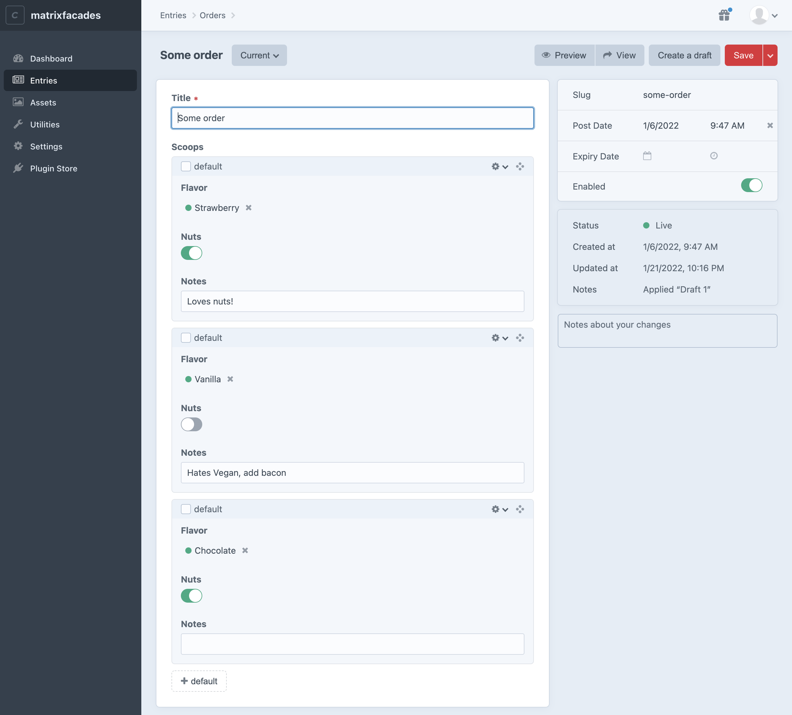

<p align="center"><a href="https://craftcms.com/" target="_blank"></a></p>

## About nystudio107/matrixfacades

This is a project demonstrates how to improve authoring experience Matrix Façades

## Using nystudio107/matrixfacades

### Initial setup

You'll need [Docker desktop](https://www.docker.com/products/docker-desktop) for your platform installed to run this project

Ensure you're using the [Docker Compose API v2](https://stackoverflow.com/questions/69464001/docker-compose-container-name-use-dash-instead-of-underscore/70295720#70295720) for the `make` commands to all work properly.

To get started:

1. Clone the git repo with:

```
git clone https://github.com/nystudio107/matrixfacades.git
```

2. Go into the project's directory:

```
   cd matrixfacades
```

3. Start up the site by typing this in the project's root directory:

```
make dev
```

If it appears to hang at `Building php_xdebug`, your PhpStorm or other IDE is likely waiting for an Xdebug connection;
quit PhpStorm or stop it from listening for Xdebug during the initial build.

4. Once the site is up and running (see below), navigate to:

```
http://localhost:8888
```

The first time you do `make dev` it will be slow, because it has to build all the Docker images.

Subsequent `make dev` commands will be much faster..

Wait until you see the following to indicate that the PHP container is ready:

```
php_1         | Craft is installed.
php_1         | Applying changes from your project config files ... done
php_1         | [01-Dec-2020 18:38:46] NOTICE: fpm is running, pid 22
php_1         | [01-Dec-2020 18:38:46] NOTICE: ready to handle connections
```

### Login

The default login is:

**URL:** `http://localhost:8888/admin`
**User:** `admin` \
**Password:** `password`

### Matrix Façades in Action

The project comes pre-populated with example content that demonstrates an example Matrix Façades.

#### Color Swatches Matrix Façade

Navigate to **Entries &rarr; Pages &rarr; Landing Page** and you'll see an example entry:



While this looks like some kind of custom UX, it's actually a Matrix Façade field which subclasses Craft Matrix Block
fields, and returns custom HTML for the user input.

Imagine you have a Page builder where the designers or admins can modify the available color schemes, and this custom UX
is presented to the content authors who can pick from the available choices.

To see behind the façade, click on the User icon in the upper-right corner of the CP, and click on the **Admin** user.
Then click on **User Settings**:



Check the **Disable Matrix Façades** checkbox, and click on **Save**.

Then navigate back to **Entries &rarr; Pages &rarr; Landing Page** and you'll see the example entry as it really is:



...a series of Matrix blocks 🪄

You can perform [Matrix Block Queries](https://craftcms.com/docs/3.x/matrix-blocks.html) on the data stored in them just
as normal.

You can even use the Matrix Criteria Behavior discussed in
the [Searching Craft CMS Matrix Blocks](https://nystudio107.com/blog/searching-craft-cms-matrix-blocks) to find entries
based on data stored in the Matrix Block fields.

The Matrix Criteria Behavior comes bundled with this project as well, so you can do things like:

```twig

```

#### Scoops Matrix Façade

Navigate to **Entries &rarr; Orders &rarr; Some order** and you'll see an example entry:



While this looks like a table, it's actually a Matrix Façade field which subclasses Craft Matrix Block fields, and
returns custom HTML for the user input.

You can modify the table by adding or removing items, and upon saving the entry, Craft will take care of updating the
Matrix Block data behind the scenes.

To see behind the façade, click on the User icon in the upper-right corner of the CP, and click on the **Admin** user.
Then click on **User Settings**:


Check the **Disable Matrix Façades** checkbox, and click on **Save**.

Then navigate back to **Entries &rarr; Orders &rarr; Some order** and you'll see the example entry as it really is:



...a series of Matrix blocks 🪄

You can perform [Matrix Block Queries](https://craftcms.com/docs/3.x/matrix-blocks.html) on the data stored in them just
as normal.

You can even use the Matrix Criteria Behavior discussed in
the [Searching Craft CMS Matrix Blocks](https://nystudio107.com/blog/searching-craft-cms-matrix-blocks) to find entries
based on data stored in the Matrix Block fields.

The Matrix Criteria Behavior comes bundled with this project as well, so you can do things like:

```twig

```

### Makefile Project Commands

This project uses Docker to shrink-wrap the devops it needs to run around the project.

To make using it easier, we're using a Makefile and the built-in `make` utility to create local aliases. You can run the
following from terminal in the project directory:

- `make dev` - starts up the local dev server listening on `http://localhost:8888/`
- `make clean` - removes the `cms/composer.lock` & the entire `cms/vendor/` directory
- `make composer xxx` - runs the `composer` command passed in, e.g. `make composer install` in the php container
- `make craft xxx` - runs the `craft` [console command](https://craftcms.com/docs/3.x/console-commands.html) passed in,
  e.g. `make craft project-config/apply` in the php container
- `make nuke` - restarts the project from scratch by running `make clean` (above), then shuts down the Docker containers, removes any mounted volumes (including the database), and then rebuilds the containers from scratch

**Tip:** If you try a command like `make craft project-config/apply --force` you’ll see an error, because the shell thinks the `--force` flag should be applied to the `make` command. To side-step this, use the `--` (double-dash) to disable further option processing, like this: `make -- craft project-config/apply --force`

Brought to you by [nystudio107](https://nystudio107.com/)
